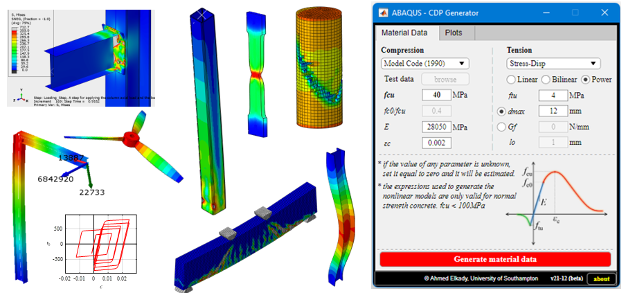

  

--------------

## ABAQUS Tools
Files and tools related to the [Youtube ABAQUS tutorial series](https://www.youtube.com/playlist?list=PLz_XdUL-6Y_k-LgmCKo5ejqRAGpfXPk23)

*** Users are highly recommeneded to fork this repository using GitHub Desktop App to receive all timely updates  (see links below if you are new to GitHub) *** 

--> Brief outline on forking, we suggest this [link](https://www.atlassian.com/git/tutorials/comparing-workflows/forking-workflow)

--> Full introduction to Git and GitHub, we suggest watching this [playlist](https://www.youtube.com/playlist?list=PLRqwX-V7Uu6ZF9C0YMKuns9sLDzK6zoiV)

## Citation

Elkady, A. (2023) "ABAQUS_CDP_Generator: A tool for generating concrete damage parameters for ABAQUS" Zenodo, Version v23.04. DOI: 10.5281/zenodo.7755926

Elkady, A. (2023) "ABAQUS_SteelMat_Generator: A tool for generating metal plastic and damage parameters for ABAQUS" Zenodo, Version v23.04. DOI: 10.5281/zenodo.7756886
